# ボルト並行実行ガイド

## 概要

build-bolt スキルは **1セッション = 1ボルト** の原則で動作する。
複数ボルトを並行実行するには、複数の `claude` CLIプロセスをそれぞれ別ターミナルで起動し、
各セッションで異なるボルトを選択する。

**なぜこの方式か:**
Claude Code のサブエージェントは他のサブエージェントを呼び出せない（ネストは1階層のみ）。
build-bolt 内部では test-generator, code-generator, refactorer 等のサブエージェントを
多数呼び出すため、ボルト自体をサブエージェントに降格させることはできない。
各ボルトはメイン会話（スキル）として動作する必要があり、並行実行は複数プロセスで実現する。

---

## 前提条件

- `aidlc-docs/plans/bolt_schedule.md` が存在すること（unit-decomposition で生成済み）
- Git リポジトリが初期化済みであること
- 統合ブランチ（main またはチームで指定したブランチ）が決定していること

---

## 並行実行ワークフロー

### 1. 並行実行グループの確認

`bolt_schedule.md` の「並行実行グループ」表を確認する。
同一グループ内のボルトは前提条件が同じであり、同時に開始できる。

```
例:
Group-1: Bolt-1.1, Bolt-2.1  ← 同時開始可能
Group-2: Bolt-1.2, Bolt-2.2  ← Group-1完了後に開始
Group-3: Bolt-3.1             ← Group-2完了後に開始
```

### 2. ボルトごとにターミナルを起動

各並行ボルトに対して個別のターミナルを開く:

```bash
# ターミナルA
claude --plugin-dir ./aidlc-plugin

# ターミナルB（別ターミナル）
claude --plugin-dir ./aidlc-plugin
```

### 3. 各セッションでボルトを選択

各ターミナルで `aidlc:build-bolt` を呼び出し、異なるボルトを選択する。
スキルが自動的に git worktree を作成し、専用の作業ディレクトリを確保する:

```
ターミナルA → Bolt-1.1 を選択
  → .worktrees/bolt-user-management-1.1/ で作業
  → ブランチ: bolt/user-management/1.1

ターミナルB → Bolt-2.1 を選択
  → .worktrees/bolt-payment-processing-2.1/ で作業
  → ブランチ: bolt/payment-processing/2.1
```

### 4. 各セッションで独立して承認ゲートを通過

各ターミナルには独自の承認ゲートがある。
開発者は各ターミナルを切り替えながら、設計レビューやテスト承認を行う。

### 5. ボルト完了 → PR作成 → マージ

各ボルトが step6 まで完了したら:
1. worktree 上の変更がコミットされる
2. 統合ブランチへのPRを作成する
3. PRレビュー後、統合ブランチにマージする
4. worktree をクリーンアップする:
   `git worktree remove .worktrees/bolt-{ユニット名}-{ボルトID}`

### 6. 全ボルト完了 → 完了モードで最終検証

全ボルトのPRがマージされたら:
1. 新しいターミナルで `claude --plugin-dir ./aidlc-plugin` を起動
2. `aidlc:build-bolt` を呼び出し、**完了モード** を選択
3. 統合ブランチ上で全体テスト・横断レビュー・to_iac.md 生成が実行される

---

## 依存ボルトの取り扱い

ボルト間に依存関係がある場合（例: Bolt-1.2 は Bolt-1.1 の完了が前提）:

1. 先行ボルト（Bolt-1.1）のPRを統合ブランチにマージする
2. その後に後続ボルト（Bolt-1.2）のセッションを開始する
   - step0 で worktree を作成する際、マージ済みの統合ブランチから分岐するため、
     先行ボルトの成果物が含まれた状態で作業を開始できる
3. step0 の前提条件チェックで、先行ボルトの verification_report が
   manifest.md に存在することを自動検証する

---

## コンフリクト対処

### 基本的にコンフリクトは発生しない

| ファイル種別 | 分離方法 | コンフリクトリスク |
|-------------|---------|-----------------|
| コード (`{project}/src/`) | ユニットごとにディレクトリが分かれる | なし |
| テスト (`{project}/tests/`) | ユニットごとにファイルが分かれる | なし |
| ドメインモデル | `{ユニット名}_domain_model.md` | なし |
| 論理設計 | `{ユニット名}_logical_design.md` | なし |
| ADR | ボルト別ID: `ADR-B{N}.{M}-{連番}` | なし |
| 検証レポート | `verification_report_{bolt}.md` | なし |
| manifest.md | ボルト別ID + 追記のみ + ブランチ分離 | 低 |

### manifest.md でコンフリクトが発生した場合

manifest.md は追記のみの設計であり、各ボルトの行はボルトIDで一意に区別される。
Git マージ時にコンフリクトが発生した場合は、**両方の追記行を全て残す**ことで解決できる。
これは「両方を採用する」だけの単純なマージ操作である。

---

## 推奨並行度

**同時2〜3ボルトを推奨する。**

理由:
- 各ボルトには step1, step2, step3, step5 の承認ゲートがあり、開発者の注意が必要
- 4ボルト以上を同時に進めると、承認の切り替えコストが増大する
- 2〜3ボルトなら、あるボルトがサブエージェント実行中（step4 等）に別ボルトの承認を行える

---

## 並行実行タイムライン（例）

```mermaid
gantt
    title ボルト並行実行タイムライン
    dateFormat  HH:mm
    axisFormat  %H:%M

    section Group-1
    Bolt-1.1 設計 (step0-2)     :a1, 00:00, 1h
    Bolt-1.1 テスト承認 (step3) :a2, after a1, 30m
    Bolt-1.1 実装 (step4-6)     :a3, after a2, 1h
    Bolt-1.1 PR・マージ          :a4, after a3, 15m

    Bolt-2.1 設計 (step0-2)     :b1, 00:00, 1h
    Bolt-2.1 テスト承認 (step3) :b2, after b1, 30m
    Bolt-2.1 実装 (step4-6)     :b3, after b2, 1h
    Bolt-2.1 PR・マージ          :b4, after b3, 15m

    section Group-2
    Bolt-1.2 設計〜実装          :c1, after a4, 2h
    Bolt-1.2 PR・マージ          :c2, after c1, 15m

    section ファイナライズ
    完了モード実行               :d1, after c2, 30m
```


