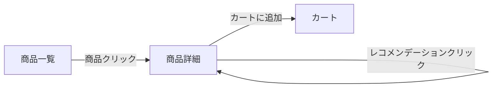

# AI-DLC UIモックアップスキル

## トリガー条件

以下の場合にこのスキルを使用する：
- ユーザーが「モックアップ」「UI設計」「画面設計」「プロトタイプ」「ワイヤーフレーム」「画面遷移」「デモ画面」「UIモック」「画面を見せたい」「見た目を先に作りたい」と言及した場合
- aidlc-user-storiesの完了後に「ステークホルダーに見せたい」「UIのイメージを固めたい」という文脈
- 実装コードの生成は別スキル（aidlc-build-bolt）の範囲

## このスキルの目的

AI-DLCの構想フェーズにおいて、ユーザーストーリーと受け入れ基準から
**視覚的なUIモックアップ**を生成し、3つの目的を果たす：

1. **ステークホルダーへのデモ・合意形成** — 「こういうものを作ります」を見せて認識を揃える
2. **チーム内のUI/UX認識合わせ** — 開発者・デザイナー間のイメージの齟齬を早期に解消
3. **フロントエンド先行開発の足場** — 構築フェーズでのUI実装の出発点を提供

## フロー上の位置づけ

```
aidlc-user-stories
       ↓
       ├──→ aidlc-mockup（任意、スキップ可能）
       ↓
aidlc-unit-decomposition
       ↓
      ...
```

aidlc-user-stories完了後に**任意で**実行する。ユニット分解の前でも後でもよく、
並行して進めることもできる。モックアップが不要なプロジェクト（API専用、
バッチ処理など画面がないシステム）ではスキップする。

モックアップの成果物は以下のスキルへの入力として活用できる：
- **aidlc-user-stories**（フィードバックループ）— モックを見てストーリー・受け入れ基準を修正
- **aidlc:build-bolt** — UIコンポーネント構造がドメインモデル設計の参考になる
- **aidlc:build-bolt** — モックがフロントエンド実装の足場になる

## 前提知識

画面設計の手法とフィデリティレベルは `references/mockup-guide.md` を参照。

---

## 入力

**必須入力：**
- `aidlc-docs/handoffs/to_units.md` — ストーリー一覧とフレーバー情報
- `aidlc-docs/story-artifacts/{ストーリーファイル}` — 各ストーリーの詳細と受け入れ基準

**補助入力（存在すれば読み込む）：**
- `aidlc-docs/requirements/nfr_definition.md` — パフォーマンス・アクセシビリティに影響するNFR
- `aidlc-docs/requirements/ubiquitous_language.md` — UI上の用語統一に使用（DDDの場合）
- `aidlc-docs/requirements/business_metrics.md` — ダッシュボード設計のKPI情報

入力が存在しない場合、aidlc-user-storiesスキルの先行実行を推奨する。

---

## ワークフロー

### ステップ0：入力の読み込みとモック方針の決定

1. ストーリー一覧と受け入れ基準を読み込む
2. ストーリーからUIが必要な範囲を特定する（APIのみのストーリーはモック対象外）
3. ユーザーに以下を確認する：

- **フィデリティレベル** — ワイヤーフレーム（構造重視）/ ミッドフィデリティ（レイアウト＋基本スタイル）/ ハイフィデリティ（ビジュアルデザイン込み）
- **対象ペルソナ** — どのペルソナの画面を優先するか
- **デザインの方向性** — ブランドカラー、トーン、既存システムとの統一感
- **対象デバイス** — デスクトップ / モバイル / 両方

フォルダ構造を作成する（存在しない場合）：

```
aidlc-docs/mockups/
├── screens/       # 個別画面モックアップ
├── flows/         # 画面遷移図
└── specs/         # インタラクション仕様
```

### ステップ1：画面一覧の作成

ストーリーの受け入れ基準から、必要な画面を洗い出す。

**画面の導出方法：**
- 受け入れ基準の「〜が表示される」「〜ページで」「〜画面で」 → 画面の候補
- ペルソナの行動フロー → 画面の遷移順序
- 受け入れ基準の「〜を入力」「〜を設定」 → フォーム/設定画面の候補
- 受け入れ基準の「〜を確認」「〜が集計される」 → ダッシュボード/レポート画面の候補

**画面一覧→承認→保存を一連の流れで行う。**

`aidlc-docs/mockups/screen_inventory.md` に保存：

```markdown
# 画面一覧

## 画面リスト
| 画面ID | 画面名 | ペルソナ | 関連ストーリー | 種別 | 優先度 |
|--------|--------|---------|--------------|------|--------|
| SCR-001 | {画面名} | {ペルソナ} | {US-XXX, US-YYY} | {一覧/詳細/フォーム/ダッシュボード} | {高/中/低} |

## 画面外のUI要素
| 要素 | 説明 | 関連ストーリー |
|------|------|--------------|
| {通知、モーダル、ツールチップ等} | {説明} | {US-XXX} |
```

### ステップ2：画面遷移図の作成

画面間のナビゲーションとユーザーフローを定義する。

**遷移の導出方法：**
- ストーリーの受け入れ基準に含まれるアクション（「クリック」「選択」「送信」）が遷移のトリガー
- ペルソナごとの主要フロー（タスク完了までの一連の画面遷移）を特定

画面遷移図はMermaidで記述し、**アーティファクトとしてその場でレンダリングして見せる。**
承認後に `aidlc-docs/mockups/flows/` にファイル保存する。
ペルソナごと、または主要ユースケースごとにフロー図を分ける。

```markdown
# 画面遷移図: {ペルソナ名 or ユースケース名}



## 遷移一覧
| 遷移元 | トリガー | 遷移先 | 関連ストーリー |
|--------|---------|--------|--------------|
| SCR-001 | 商品クリック | SCR-002 | US-005 |
```

**画面遷移図→承認→保存を一連の流れで行う。**

### ステップ3：UIモックアップの生成

優先度の高い画面から順に、インタラクティブなモックアップを生成する。

**モックアップはReact（.jsx）またはHTML（.html）で生成し、その場でレンダリングして見せる。**
デプロイは不要。Claude.aiのアーティファクト機能でブラウザ内に即座に表示され、
ユーザーはそのまま操作・確認できる。

**生成→表示→レビュー→保存の流れ：**
1. AIが画面のモックアップを生成し、**アーティファクトとしてその場でレンダリングする**
2. ユーザーが画面を見ながらレビューし、修正を指示する
3. AIが修正を反映し、再度レンダリングして確認する
4. ユーザーが承認したら、**記録・後続スキルへの引き継ぎ用にファイルに保存する**

**レビュー中のストーリーフィードバック記録：**
モックを見て「この受け入れ基準は変更すべき」「新しいストーリーが必要」など
ユーザーストーリーへのフィードバックが出た場合、**合意した都度**
`aidlc-docs/mockups/story_feedback.md` に追記する。最後にまとめるのではなく、
議論の中で合意が得られたタイミングで即座に記録する。

```markdown
# ストーリーへのフィードバック（モックレビューから）

## FB-001: {フィードバック概要}
- 発生元画面: {SCR-XXX}
- 関連ストーリー: {US-XXX}
- 種別: {受け入れ基準の修正 / 新規ストーリー追加 / ストーリー分割 / NFR追加}
- 合意内容: {何をどう変えるか}
- 合意日時: {タイムスタンプ}

## FB-002: {フィードバック概要}
...
```

このファイルは蓄積式で、画面レビューのたびに追記されていく。
全モックアップ完了後に、このファイルをaidlc-user-storiesスキルへの
フィードバック入力として使用する。

保存先: `aidlc-docs/mockups/screens/{画面ID}_{画面名}.jsx`（または `.html`）

ファイル保存は記録目的。ユーザーがモックを見て議論するのは、
会話内にレンダリングされたアーティファクト上で行う。

**モックアップ生成のガイドライン：**

- ストーリーの受け入れ基準に記載された要素を漏れなく含める
- DDDフレーバーの場合、UI上のラベルやメッセージにユビキタス言語を使用する
- ダミーデータを含め、実際のユースケースが想像できる状態にする
- インタラクション（ボタンクリック、フォーム入力、状態遷移）を動作させる
- アクセシビリティの基本（セマンティックHTML、色コントラスト、キーボード操作）を考慮する

**フィデリティレベルによる生成内容の違いは `references/mockup-guide.md` を参照。**

### ステップ4：インタラクション仕様の記述

各画面のインタラクションの詳細を文書化する。
モックアップだけでは伝わらないビジネスルールや条件分岐を明記する。

`aidlc-docs/mockups/specs/{画面ID}_interaction_spec.md` に保存：

```markdown
# インタラクション仕様: {画面名}

## 画面概要
| 項目 | 値 |
|------|-----|
| 画面ID | {SCR-XXX} |
| ペルソナ | {ペルソナ名} |
| 関連ストーリー | {US-XXX, US-YYY} |

## 要素一覧
| 要素 | 種別 | 初期状態 | インタラクション |
|------|------|---------|----------------|
| {要素名} | {ボタン/入力/リスト/...} | {初期値/非表示/無効} | {クリック→{動作}, 入力→{バリデーション}} |

## 状態遷移
| 現在の状態 | トリガー | 次の状態 | 表示変化 |
|-----------|---------|---------|---------|
| {初期表示} | {ユーザーアクション} | {ロード中} | {スピナー表示} |

## バリデーションルール
| フィールド | ルール | エラーメッセージ |
|-----------|--------|---------------|

## エッジケース
| ケース | 画面の振る舞い | 関連受け入れ基準 |
|--------|-------------|----------------|
| {データ0件} | {空状態メッセージ表示} | {US-XXX AC-3} |
| {API障害} | {エラーメッセージ表示} | {US-XXX AC-4} |
```

### ステップ5：横断レビューとフィードバック

サブエージェントで全モックアップの横断的な整合性をレビューする。

**レビュー観点：**
1. **ストーリー網羅性** — 全ストーリーの受け入れ基準が画面要素として反映されているか
2. **画面遷移の完全性** — 受け入れ基準のアクションがすべて遷移図に含まれているか
3. **用語の一貫性** — 画面上のラベル・メッセージがストーリー（およびユビキタス言語）と一致しているか
4. **ペルソナ網羅性** — 全ペルソナのワークフローがモックアップでカバーされているか
5. **インタラクション仕様の網羅性** — エッジケース（0件、エラー、権限なし等）が記述されているか

レビュー結果を `aidlc-docs/reports/cross_review_report.md` に追記（他スキルのレビュー結果と共存）。

**ユーザーへのフィードバック促進：**
モックアップをユーザー（およびステークホルダー）に提示し、フィードバックを収集する。
フィードバックの種類に応じた対応：

| フィードバック | 対応先 |
|-------------|--------|
| 画面レイアウト・デザインの修正 | このスキルでモックアップを更新 |
| ビジネスロジックの変更 | `story_feedback.md` に記録し、aidlc-user-storiesで修正 |
| 新しい機能の追加要望 | `story_feedback.md` に記録し、aidlc-user-storiesで追加 |

横断レビューで新たにストーリーへのフィードバックが検出された場合も
`story_feedback.md` に追記する。ステップ3で蓄積した内容に横断レビュー分が加わる形になる。

### ステップ6：成果物サマリーの出力

全成果物のサマリーを `aidlc-docs/mockups/mockup_summary.md` に保存する：

```markdown
# モックアップサマリー

## 生成情報
| 項目 | 値 |
|------|-----|
| フィデリティレベル | {ワイヤーフレーム/ミッド/ハイ} |
| 対象デバイス | {デスクトップ/モバイル/両方} |
| 画面数 | {N}画面 |
| カバーしたストーリー | {N}/{全ストーリー数} |

## 画面一覧とファイルパス
| 画面ID | 画面名 | モックファイル | 仕様ファイル |
|--------|--------|-------------|------------|
| SCR-XXX | {名前} | mockups/screens/{ファイル} | mockups/specs/{ファイル} |

## 画面遷移図
| フロー名 | ファイルパス |
|---------|------------|
| {名前} | mockups/flows/{ファイル} |

## フィードバック履歴
| # | フィードバック内容 | 対応 | ステータス |
|---|----------------|------|----------|

## ストーリーへのフィードバック
- 件数: {N}件
- ファイル: aidlc-docs/mockups/story_feedback.md
- 対応状況: {全件未対応 / N件対応済み / 全件対応済み}

## 後続スキルへの情報
- aidlc-user-storiesへ: `story_feedback.md` に基づくストーリー・受け入れ基準の修正が必要
- aidlc:build-boltへ: UIコンポーネント構造がドメインモデルの参考情報として利用可能
- aidlc:build-boltへ: モックアップがフロントエンド実装の足場として利用可能
```

prompts.mdにも各ステップの実行記録を追記する。
フォーマットはaidlc-user-storiesスキルで定義された形式に従う。

---

## 対話スタイルのガイドライン

1. **まず見せる** — 説明や仕様の前にモックアップをレンダリングして見せる。視覚的に議論するほうが早い
2. **会話内で完結させる** — モックはアーティファクトとしてその場で表示する。別ツールやデプロイを求めない
3. **1画面ずつ段階的に** — 全画面を一度に出さず、優先度順に生成→表示→レビュー→承認
4. **フィードバックの行き先を明示する** — UI修正はここで、ロジック修正はuser-storiesで、と切り分けを明確にする
5. **ダミーデータをリアルに** — 「テスト」「サンプル」ではなく、実際のユースケースを想起できる具体的なデータを使う

---

## ありがちな失敗パターンと対策

- **受け入れ基準との乖離** → 画面要素を受け入れ基準と1:1で対応付け、漏れを検出
- **エッジケースの見落とし** → インタラクション仕様で0件/エラー/権限なし等を明示的に記述
- **用語のブレ** → DDDの場合、ユビキタス言語用語集をUI上のラベルに厳密に適用
- **デザインにこだわりすぎて遅延** → フィデリティレベルを最初に合意し、スコープを守る
- **フィードバックが散逸** → フィードバック履歴をサマリーに記録し、対応状況を追跡
